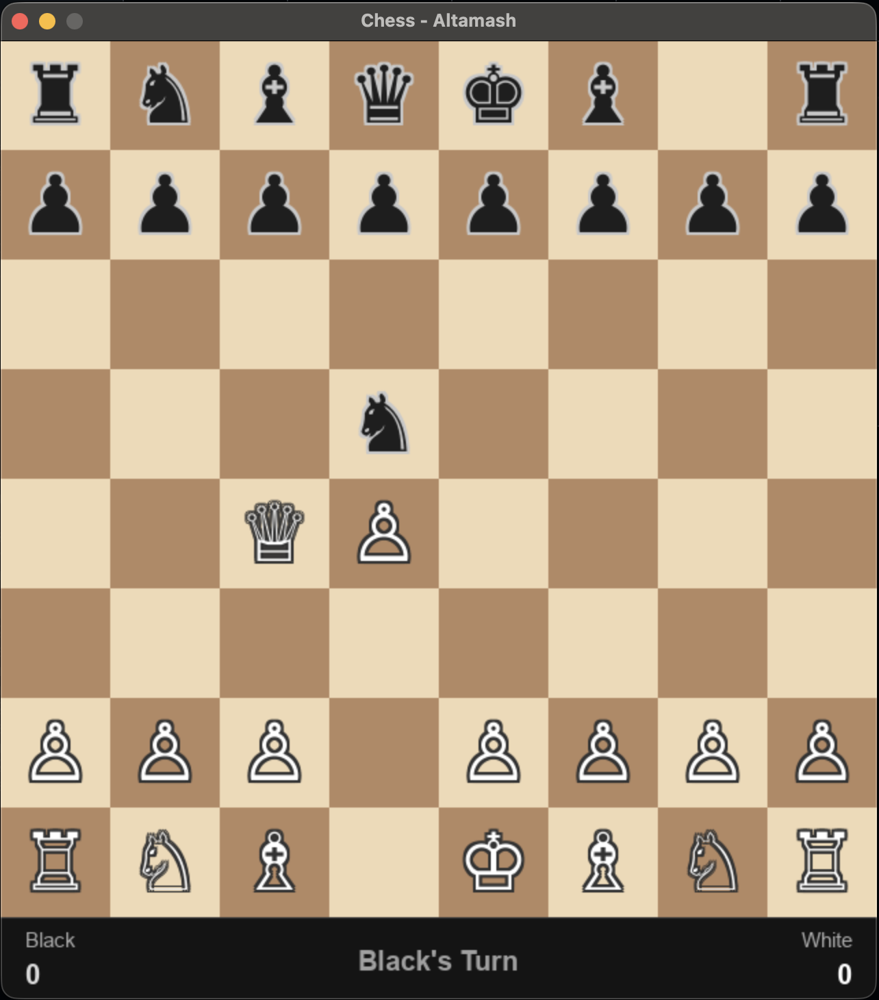

# Chess Game 🎮

built this to practice OOP and get better at Python and also to play chess with friends in class instead of boring college lectures hahah :)

## How to Run

-> on your os terminal run these commands
  
- pip3 install pygame
- python3 main.py

## How to Play

- Click a piece to select it
- Green squares show where it can move
- Click a green square to move
- Bottom bar shows whose turn it is and the score
- Game announces CHECK, CHECKMATE, or STALEMATE automatically

## features

- 8x8 board (as chess tradition demands)
- Fully movable pieces
- Legal move validation
- Zero A.I but will add sooooonnn [only after learning it, lol]

## Built With

- Python 3
- Pygame
- Mild overconfidence
- Aggressive debugging
- Questionable life choices haha

Now it might seem like a normal boring project but even a simple hello world printed with your knowledge is better than a A.I project with zero understanding of it, also if you wanna contribute feel free to do so as the code is easy to understand and

 Each file has a purpose
 Unlike my sleep schedule.

For all the chess enthusiasts, remember that..

 The code is clean. The competition won’t be.

